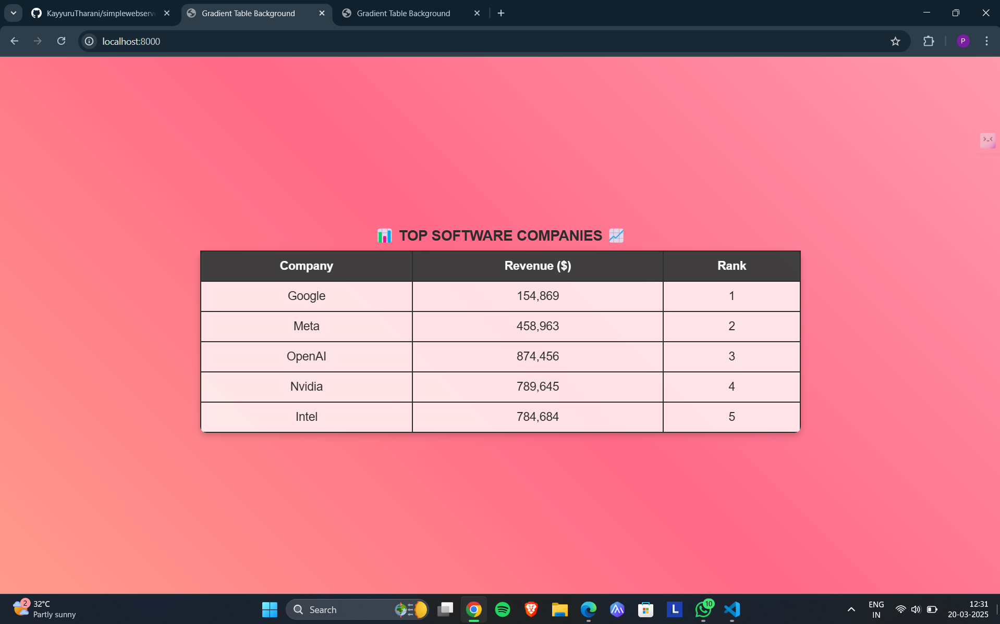
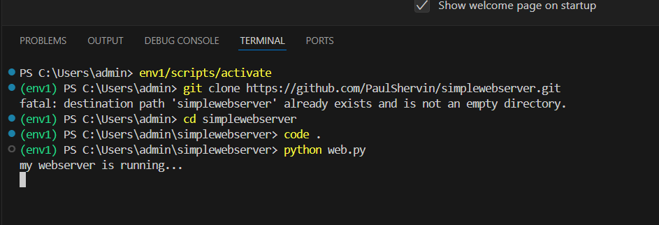

# EX01 Developing a Simple Webserver
## Date:20/3/2024

## AIM:
To develop a simple webserver to serve html pages and display the list of protocols in TCP/IP Protocol Suite.

## DESIGN STEPS:
### Step 1: 
HTML content creation.

### Step 2:
Design of webserver workflow.

### Step 3:
Implementation using Python code.

### Step 4:
Import the necessary modules.

### Step 5:
Define a custom request handler.

### Step 6:
Start an HTTP server on a specific port.

### Step 7:
Run the Python script to serve web pages.

### Step 8:
Serve the HTML pages.

### Step 9:
Start the server script and check for errors.

### Step 10:
Open a browser and navigate to http://127.0.0.1:8000 (or the assigned port).

## PROGRAM:
```
from http.server import HTTPServer, BaseHTTPRequestHandler
content = """
<!DOCTYPE html>
<html lang="en">
<head>
    <meta charset="UTF-8">
    <meta name="viewport" content="width=device-width, initial-scale=1.0">
    <title>Top Software Company </title>
    <style>
        body {
            background: linear-gradient(45deg, #FF9A8B, #FF6A88, #FF99AC);
            height: 100vh;
            margin: 0;
            display: flex;
            justify-content: center;
            align-items: center;
            font-family: Arial, sans-serif;
        }
        table {
            border-collapse: collapse;
            width: 60%;
            height: auto;
            background: rgba(255, 255, 255, 0.8); /* Semi-transparent background */
            color: #2c2c2c;
            border-radius: 10px;
            box-shadow: 0px 4px 10px rgba(0, 0, 0, 0.2);
            overflow: hidden;
        }
        th, td {
            border: 2px solid #2C2C2C;
            padding: 12px;
            text-align: center;
            font-size: 18px;
        }
        th {
            background-color: rgba(44, 44, 44, 0.9);
            color: white;
        }
        caption {
            font-size: 22px;
            font-weight: bold;
            padding: 10px;
            color: #2C2C2C;
        }
    </style>
</head>
<body>
    <table>
        <caption>📊 TOP SOFTWARE COMPANIES 📈</caption>
        <tr>
            <th>Company</th>
            <th>Revenue ($)</th>
            <th>Rank</th>
        </tr>
        <tr>
            <td>Google</td>
            <td>154,869</td>
            <td>1</td>
        </tr>
        <tr>
            <td>Meta</td>
            <td>458,963</td>
            <td>2</td>
        </tr>
        <tr>
            <td>OpenAI</td>
            <td>874,456</td>
            <td>3</td>
        </tr>
        <tr>
            <td>Nvidia</td>
            <td>789,645</td>
            <td>4</td>
        </tr>
        <tr>
            <td>Intel</td>
            <td>784,684</td>
            <td>5</td>
        </tr>
    </table>
</body>
</html>

"""
class myhandler(BaseHTTPRequestHandler):
    def do_GET(self):
        print("request received")
        self.send_response(200)
        self.send_header('content-type', 'text/html; charset=utf-8')
        self.end_headers()
        self.wfile.write(content.encode())
server_address = ('',8000)
httpd = HTTPServer(server_address,myhandler)
print("my webserver is running...")
httpd.serve_forever()
```

## OUTPUT:




## RESULT:
The program for implementing simple webserver is executed successfully.
